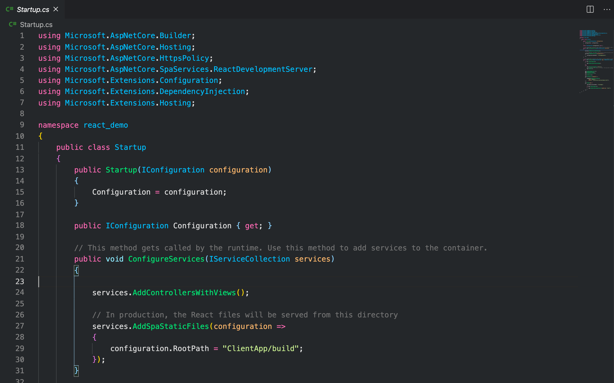
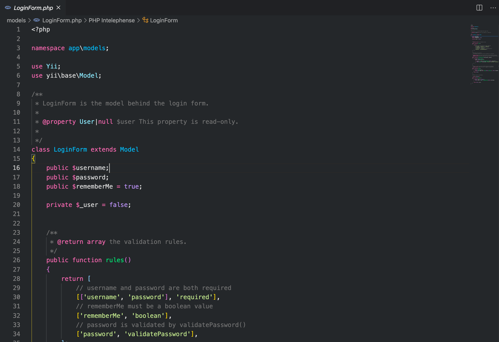
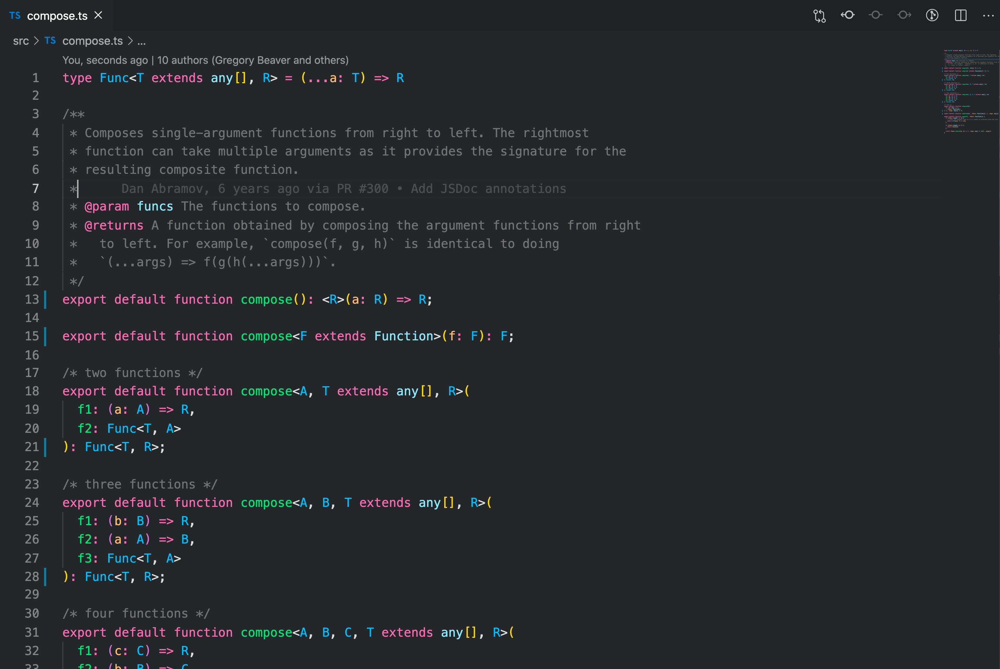
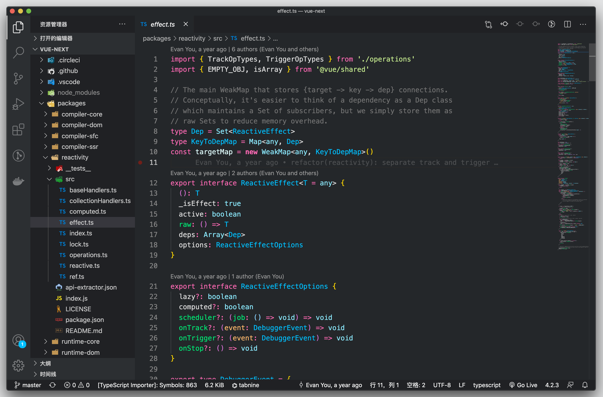

# 为专注而极简

外观主题色来自 Google 浏览器的深色主题色，代码外观色提取自大名鼎鼎的 Dracula 主题

## 一目了然，更容易大展身手

清晰的青色和道奇蓝让你的代码看起来更加丰富多彩

在 C#中

在 PHP 中

导入类类型和当前页命名空间以及类更加清晰

在 TS 中, 优化了类型

更加清晰的 HTML

## 黑而不凡

极致外观，只为最求极致的你

## 更方便的个人扩展

什么样，随你而定[quick  start](./quick_start.md)
